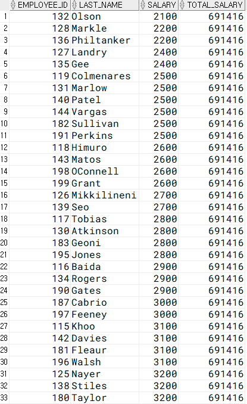

# FUNCTION - 윈도우 함수

## 윈도우 함수 

* 윈도우 함수는 **행 행 간의 관계를 정의하**기 위해서 제공되는 함수다. 
* 윈도우 함수를 사용해서 순위, 합계, 평균, 행 위치 등을 조작할 수 있다. 

```sql
SELECT WINDOW_FUNCTION(ARGUMENTS) -- 함수에 따라서 0~n개의 인수를 설정한다 
    OVER (PARTITION BY 컬럼        -- 전체 집합을 기준에 의해 소그룹으로 나눈다 
        ORDER BY WINDWOING ~ )    -- ORDER BY : 어떤 항목에 대해서 정렬한다 
                                  -- WINDOWING : 행 기준의 범위를 정한다 
FROM 테이블명 ; 
```

## WINDOWING 

| 구조 | 설명 |
| :--- | :--- |
| ROWS | 부분 집합인 윈도우 크기를 물리적 단위로 행의 집합을 지정한다 |
| RANGE | 논리적인 주소에 의해 행 집합을 지정한다  |
| BETWEEN ~ AND | 윈도우의 시작과 끝의 위치를 지정한다  |
| UNBOUNDED PRECEDING | 윈도우의 시작 위치가 첫 번째 행임을 의미한다  |
| UNBOUNDED FOLLOWING  | 윈도우의 마지막 위치가 마지막 행임을 의미한다  |
| CURRENT ROW | 윈도우 시작 위치가 현재 행임을 의미한다  |

```sql
SELECT employee_id, last_name, salary, 
       sum(salary) OVER (ORDER BY salary 
                        ROWS BETWEEN UNBOUNDED PRECEDING --첫번째 행부 
                        AND UNBOUNDED FOLLOWING) TOTAL_SALARY --마지막 행까
FROM employees ; 

--TOTAL_SALARY는 처음 행부터 마지막 행까지의 합계(SUM(salary))를 계산한다                                 
```




```sql
SELECT employee_id, last_name, salary, 
       sum(salary) OVER (ORDER BY salary 
                        ROWS BETWEEN UNBOUNDED PRECEDING --첫번째 행부터
                        AND CURRENT ROW) CUM_SALARY --현재 행까
FROM employees ; 

--CUM_SALARY는 행 별로 누적 합계를 구한다 
```


```sql
SELECT employee_id, last_name, salary, 
       sum(salary) OVER (ORDER BY salary 
                        ROWS BETWEEN CURRENT ROW --현재 행부터 
                        AND UNBOUNDED FOLLOWING) TO_SALARY --마지막 행까
FROM employees ; 

--TO_SALARY는 현재 행부터 마지막 행까지의 합계를 구한다 
```

